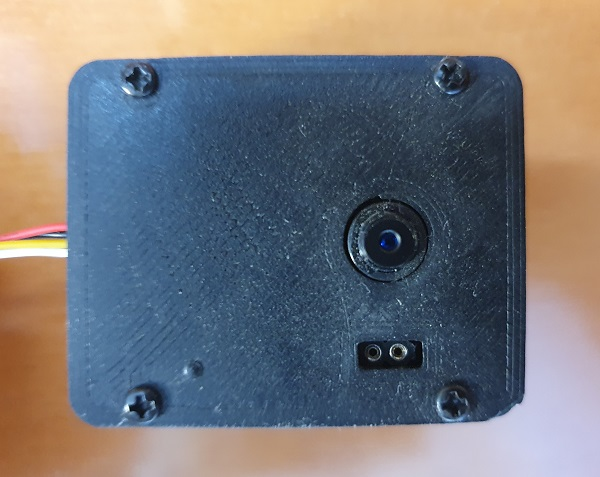
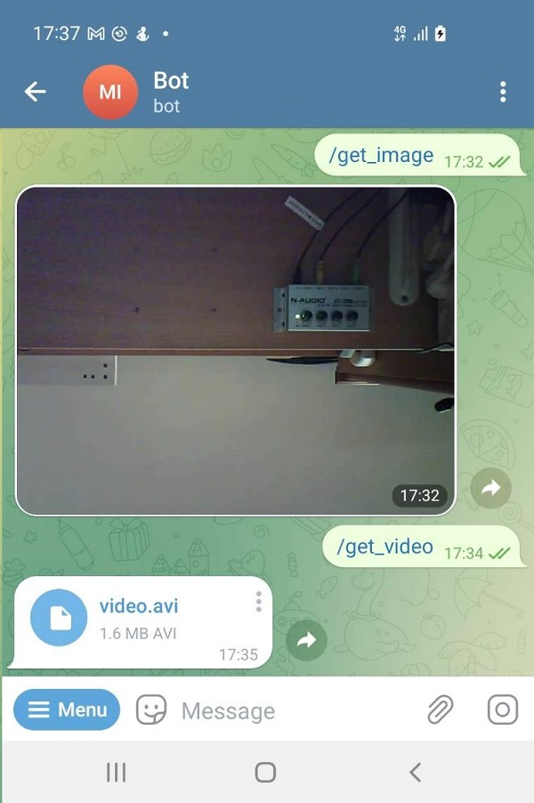

# ESP32_Camera
Get images and short videos from the camera to your Telegram Bot.

## Setup
There are two modes:
* Setup Mode
* Normal Mode

In order to enter the **Setup Mode** you need to push the **reset** button after first LED blink at the beginning.
You have 3 seconds to accomplish this goal before second LED blink. If you are in **Setup Mode**, 
you need to connect from your mobile phone to the camera directly using WiFi connection.
When you are connected to the camera, enter it using web browser and enter the following data:
* SSID
* Password
* Hostname
* Telegram Bot Token

When all the data entered, push **reset** button again and the camera will connect to the WiFi router in **Normal Mode**.

## Telegram
* Use **/get_image** to get an image from the camera.
* Use **/get_video** to get a short video from the camera.

## Parts
| Qty | Product                                                                                                                                                                                                                                                                                                                                                                                                                                                                                                                                                                       | Description         |
| --- |-------------------------------------------------------------------------------------------------------------------------------------------------------------------------------------------------------------------------------------------------------------------------------------------------------------------------------------------------------------------------------------------------------------------------------------------------------------------------------------------------------------------------------------------------------------------------------|---------------------|
|1 | [ESP32-Cam](https://www.aliexpress.com/item/1005004120984897.html?spm=a2g0o.productlist.main.5.7ebd5R2y5R2ysE&algo_pvid=678d2370-c73c-435f-8e1a-0062318aa8d0&aem_p4p_detail=202301041132542689900734771900001747408&algo_exp_id=678d2370-c73c-435f-8e1a-0062318aa8d0-2&pdp_ext_f=%7B%22sku_id%22%3A%2212000028106690443%22%7D&pdp_npi=2%40dis%21ILS%2144.81%2129.13%21%21%21%21%21%402100bc5c16728607741953639d0742%2112000028106690443%21sea&curPageLogUid=Z9I8xc8jFaRt&ad_pvid=202301041132542689900734771900001747408_3&ad_pvid=202301041132542689900734771900001747408_3) | Main board + Camera |

## Notes
[ArduinoJson](https://github.com/bblanchon/ArduinoJson) must be installed.

Set desired **upload_port** in the file **platformio.ini** file.

## Connection Diagram

